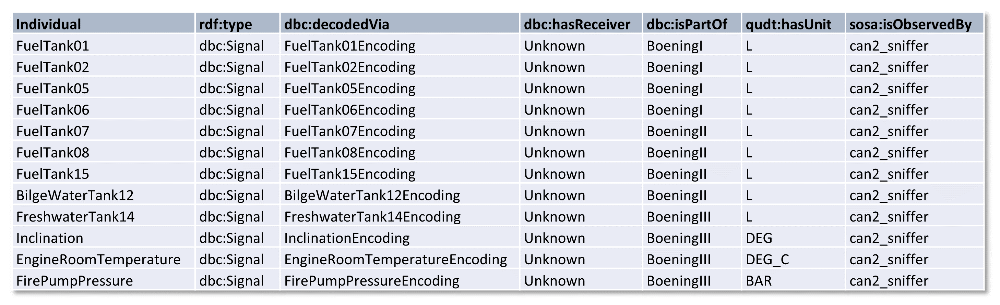
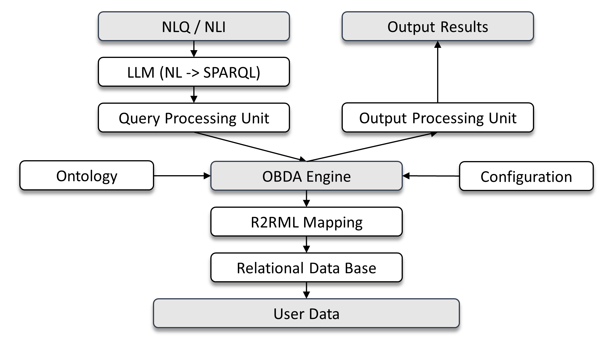

# FAUST: Fine-tuning Automation System for LLM-driven Semantic Data Analysis


## Abstract:

Knowledge graph question answering (KGQA) based on large language models (LLMs) has gained significant traction, particularly on large-scale, schema-light datasets.
However, existing approaches do not fully address the semantic, structural, and mapping requirements of ontology-based data access (OBDA).
This limitation is especially relevant in domains such as cyber-physical systems, where data is semantically rich, heterogeneous, and dynamically changing.
Moreover, large cloud-based LLMs, while proven effective in general-purpose QA, may introduce high computational costs and data privacy concerns in such domains.
A straightforward alternative is to use locally deployed LLMs; however, without task-specific adaptation, they typically fail to achieve sufficient performance.
To address these challenges, we present FAUST, an automated fine-tuning system for semantic data analysis.
Given an ontology, FAUST generates OBDA-compliant training datasets consisting of system prompts, natural-language instructions, and corresponding SPARQL queries, enabling efficient fine-tuning of local LLMs for OBDA scenarios.
In addition, we introduce the Modular OBDA Architecture (MOA), which integrates LLM-based query generation with an OBDA engine and supports interactive querying over both static and streaming data sources.
We evaluate our approach on real-world sensor data in terms of query accuracy, latency, and output correctness.
The results show that FAUST-based lightweight LLM fine-tuning enables robust, cost-efficient, and semantically accurate question answering, outperforming (i) raw local LLMs, (ii) prompt-engineering methods, and (iii) cloud-based LLMs.

## FAUST Modules:
<p align="center">
  
</p>

<p align="center">
  <em>The logical Data Flow Diagram of FAUST, including external, process, and store elements.</em>
</p>


FAUST consists of several modular components for automatic generation of NL-to-SPARQL training datasets from domain ontologies. The framework starts with the KG Maker, which instantiates the ontology using a configurable knowledge graph matrix (KGM) and produces the initial knowledge graphs. Next, the KG Reader queries these graphs and generates reusable ontology elements, such as classes, properties, instances, date ranges, and value samples, used throughout dataset generation.

The Agnostic Module (AM) creates ontology-independent NL/SPARQL pairs using generic RDF/OWL concepts (e.g., classes, instances, properties). The General Module (GM) focuses on ontology-specific conceptual queries derived from competency-question templates, capturing semantic relations between classes and properties. The Domain Module (DM) extends this process with instance-level knowledge, generating realistic OBDA queries involving domain entities, measurements, aggregations, and temporal constraints.

Finally, the Orchestrator coordinates all modules and combines their outputs into complete training and validation datasets, exported in JSON or CSV format for LLM fine-tuning.

## Ontology Documentation:

DBC Ontology Specification (`w3id.org/dbc-ontology`), used for FAUST implementation:

[](https://paitools.github.io/DBCOntology/documentation/index-en.html)

## FAUST User Guide

### Quick Start

To install and run FAUST locally on macOS or Linux, clone the repository, create a virtual environment, install the package in editable mode, and run the main script:

```bash
git clone https://github.com/paitools/FAUST.git
cd FAUST
python -m venv .venv
source .venv/bin/activate
pip install -e .
python main.py
```

For Windows Command Prompt, use:

```cmd
git clone https://github.com/paitools/FAUST.git
cd FAUST
python -m venv .venv
.venv\Scripts\activate.bat
pip install -e .
python main.py
```

This installs FAUST and its dependencies into the virtual environment while keeping the local repository editable. Running `python main.py` starts the FAUST pipeline using the configuration files and input data included in the repository.

Running **FAUST** involves two steps:

1. **Knowledge Graph Matrices (KGMs) Population**
2. **FAUST Deployment**

### 1. KGM Population

<p align="center">
  
</p>

<p align="center">
  <em>Signal representation in KGM, including individuals, type, and properties.</em>
</p>

KGM presents a tabular format for mapping individuals (instances) with corresponding properties. Each sheet in the document depicts a single class, with the first column reserved for instances, while the remaining ones reflect combined data and object properties. Also, the user is not required to define datatypes for each literal, as this is resolved in the later OBDA mapping phase. An example representation of dbc:Signal instances (individuals) is shown above. 

The user is required to populate KVM with their own domain-specific instances and save it to the /KVM folder, as a reference.
In the next iteration, KVM can be split into KVM_train and KVM_val, although it is not mandatory.
The general recommendation is to populate the KGM with all instances first, then extract 10-15% of the instances on each sheet to create a validation set (KVM_val).

### 2. FAUST Deployment

- After verifying the KGM, check the config file `config.yaml`, and ensure that the settings reflect project requirements.
  
- Deploy the framework:
  ```bash
  python3 FAUST.py

Results: Training and Validation datasets are created in the project root directory. 

### 3. FAUST Adaptation to other domains

- Adapting FAUST to different domains/ontologies requires modification of the following modules:

KG Reader:
- The module consists of two submodules, one dedicated to agnostic and the other to domain-specific dataset generation. The role of both submodules is to query the knowledge graphs and create various lists of ontology elements. At the software level, the query is performed via dedicated functions that typically return prefix-name pairs as embedded lists.
- For a new domain, the user should focus only on the domain-specific submodule functions and replace current DBC classes with new ones (see KGM Population).
- Example: A domain-specific function `list_random_signals(kg: str, n: int)` can be modified to return a list of sensors instead of signals by simply replacing the query:

  `SELECT DISTINCT ?signal WHERE { ?signal a dbc:Signal . }`
  
  with query:
  
  `SELECT DISTINCT ?sensor WHERE { ?sensor a sosa:Sensor . }`                                                                                              


## Modular OBDA Architecture

<p align="center">
  
</p>

<p align="center">
  <em>The Modular OBDA Architecture (MOA).</em>
</p>

To streamline the development of LLM-driven OBDA systems, we designed MOA, a Modular OBDA Architecture that supports independent, project-specific implementation of individual system components.
Its modular design promotes reuse across platforms, systems, and programming environments.
For example, the user plane can be implemented as a standalone GUI application, an embedded component, or a web-based frontend, while the architecture supports integration with diverse LLM deployments, including local, institution-hosted, and cloud-based models.

Modular OBDA Architecture (MOA) is organized as a modular multi-layer system comprising, from top to bottom, the user plane, an LLM-based translation layer, the processing unit, an OBDA engine linking the ontology to the system configuration, the mapping layer, a relational database, and the data layer.
This structure allows each component to be implemented independently, thereby increasing architectural flexibility and supporting a wide range of deployment scenarios.

## MOA Implementation

- To run the MOA GUI (Linux) Application, set the corresponding Ollama-built LLM model in the App's config section and run:

   ```bash
   python3 MOA_App.py

- The recommendation for the OBDA Engine is the [Ontop Endpoint CLI](https://ontop-vkg.org/tutorial/endpoint/endpoint-cli.html), although the Docker version is also available.


- An example configuration, including input files, db, jdbc, and a data sample (raw data), is available in the /Ontop folder.
- To start the Ontop endpoint, run:

   ```bash
   ./ontop endpoint --ontology=input/DBC.ttl --mapping=input/mapping.ttl --properties=input/ontop.properties --port=8080


Module Requirements:

- customtkinter
- tkinter
- requests
- ollama


## License

All resources are licensed under the [Creative Commons Attribution 4.0 International (CC BY 4.0)](https://creativecommons.org/licenses/by/4.0/) license.


## Citation

🔴 Correct DOI!

Ivanovic, P., Hranisavljevic, N., & Maleshkova, M. (2026). paitools/FAUST: Fine-tuning Automation System v1.0: Pre-publication Release. Zenodo. https://doi.org/10.5281/zenodo.20083471

