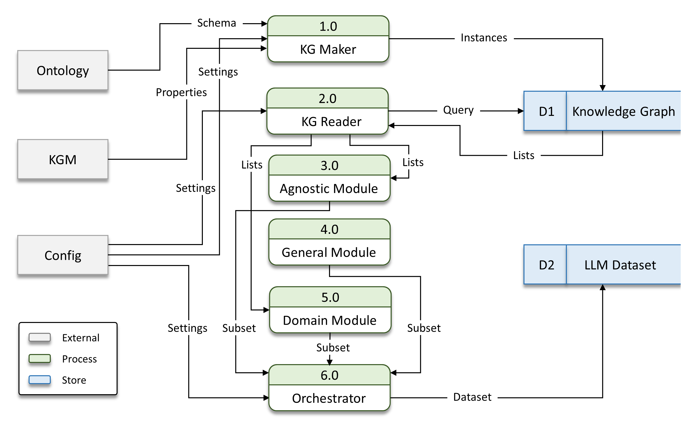

# FAUST: Fine-tuning Automation System for LLM-driven Semantic Data Analysis


## Abstract:

Knowledge graph question answering (KGQA) based on large language models (LLMs) has gained significant traction, particularly on large-scale, schema-light datasets.
However, existing approaches do not fully address the semantic, structural, and mapping requirements of ontology-based data access (OBDA).
This limitation is especially relevant in domains such as cyber-physical systems, where data is semantically rich, heterogeneous, and dynamically changing.
Moreover, large cloud-based LLMs, while proven effective in general-purpose QA, may introduce high computational costs and data privacy concerns in such domains.
A straightforward alternative is to use locally deployed LLMs; however, without task-specific adaptation, they typically fail to achieve sufficient performance.
To address these challenges, we present FAUST, an automated fine-tuning system for semantic data analysis.
Given an ontology, FAUST generates OBDA-compliant training datasets consisting of system prompts, natural-language instructions, and corresponding SPARQL queries, enabling efficient fine-tuning of local LLMs for OBDA scenarios.
In addition, we introduce the Modular OBDA Architecture (MOA), which integrates LLM-based query generation with an OBDA engine and supports interactive querying over both static and streaming data sources.
We evaluate our approach on real-world sensor data in terms of query accuracy, latency, and output correctness.
The results show that FAUST-based lightweight LLM fine-tuning enables robust, cost-efficient, and semantically accurate question answering, outperforming (i) raw local LLMs, (ii) prompt-engineering methods, and (iii) cloud-based LLMs.

## FAUST Modules:


<p align="center"><em>DBC Ontology: The core concepts and semantic relationships</em></p>


FAUST consists of several modular components for automatic generation of NL-to-SPARQL training datasets from domain ontologies. The framework starts with the KG Maker, which instantiates the ontology using a configurable knowledge graph matrix (KGM) and produces the initial knowledge graphs. Next, the KG Reader queries these graphs and generates reusable ontology elements, such as classes, properties, instances, date ranges, and value samples, used throughout dataset generation.

The Agnostic Module (AM) creates ontology-independent NL/SPARQL pairs using generic RDF/OWL concepts (e.g., classes, instances, properties). The General Module (GM) focuses on ontology-specific conceptual queries derived from competency-question templates, capturing semantic relations between classes and properties. The Domain Module (DM) extends this process with instance-level knowledge, generating realistic OBDA queries involving domain entities, measurements, aggregations, and temporal constraints.

Finally, the Orchestrator coordinates all modules and combines their outputs into complete training and validation datasets, exported in JSON or CSV format for LLM fine-tuning.

## Ontology Documentation:

Ontology Specification with permanent `w3id.org` identifier:

[](https://paitools.github.io/DBCOntology/documentation/index-en.html)

## FAUST User Guide

Running **CANDI** on user hardware involves two automated steps:

1. **Create the Knowledge Graph Matrix (KGM)**
2. **Deploy the Framework**


### 1. KGM Creation

1. Set the `DBC_FILE` path in the `load_dbc.py` configuration (e.g., `DBC/boening.dbc`).
   
2. Run the script:
   ```bash
   python3 load_dbc.py
   
- The script will also load unit_mapping.json to convert user-defined DBC units into QUDT standard units (e.g., `kW` → `KiloW`).
  * If a unit is not found in the mapping file, the original value is preserved and a warning is issued.

- **Output:** a file named  `KGM.xlsx` will be generated in the project’s root directory.

### 2. CANDI Deployment

- After verifying the KGM, set the `raw_data_path` to your CAN bus logging structure (e.g., `raw/*/*/*/*.csv`).
  
- Deploy the framework:
  ```bash
  python3 CANDI.py

### Running SPARQL

- To run SPARQL queries (e.g., `user_query.rq`) on real-time data:

   ```bash
   ontop.bat query -p ontop.properties -m mapping.ttl -q user_query.rq

Requirements

- DuckDB ≥ `1.0.0`
- Ontop client ≥ `5.3.0`

Ensure both are installed before running the framework. 
If compatibility issues occur, use the exact versions listed above.


## Code Modification


### Changing Logging Structure and File Format

Let's say we want to change the logging path to a different structure or directory (e.g., `/home/logs/*.json`).

Like before, in the CANDI.py source code, set the `raw_data_path` to the new logging structure `/home/logs/*.json`

However, this time, the file format is changed from `csv` to `json` and we need to change the message log reading function accordingly.

Now, search for messagelog view and change the `read_csv_auto()` function to `read_json()`. Notice that `raw_data_path` will also receive the newly configured value.

Save the changes and redeploy the framework:

```bash
python3 CANDI.py
```

Result: CANDI now operates with the new logging structure and `json` file format.


### Supported Formats

| Format   | Function         |
|----------|------------------|
| csv      | read_csv_auto()  |
| json     | read_json()      |
| tsv      | read_csv_auto()  |
| parquet  | read_parquet()   |
| jsonl    | read_ndjson()    |


## License

All resources are licensed under the [Creative Commons Attribution-NonCommercial-ShareAlike 4.0 International](https://creativecommons.org/licenses/by-nc-sa/4.0/) license.


